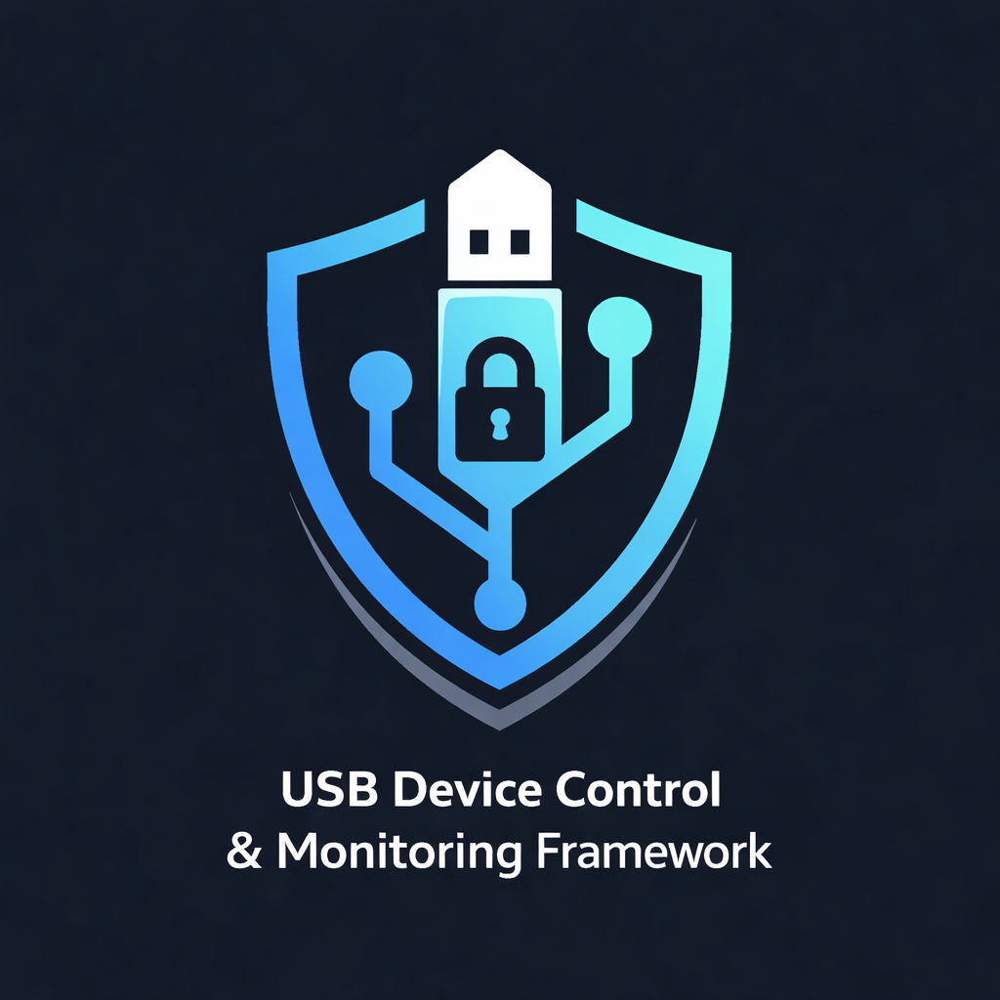

# USB Device Control & Monitoring Framework

<p align="center">
  
</p>

A powerful, robust Windows 11 security tool designed to detect, control, and audit USB mass storage device usage. Featuring a modern CustomTkinter GUI, it provides real-time monitoring, automated blocking of unauthorized devices, and detailed file activity logging.

## Features

*   **🛡️ Access Control**: Automatically blocks any USB device not in your `allowlist`.
*   **🔌 Real-Time Monitoring**: Instantly detects device insertion/removal.
*   **💻 Modern GUI**:
    *   **Device Cards**: Visualize connected devices with status (Online/Offline, Allowed/Blocked).
    *   **Interactive Controls**: One-click Block/Unblock buttons.
    *   **Live Logs**: View USB events and file activity in real-time.
*   **🚫 Robust Blocking**: Handles devices in "pending reboot" states and prevents race conditions.
*   **📂 File Auditing**: Tracks file creation, deletion, modification, and copying on allowed drives.
*   **📊 Reporting**: Generates comprehensive audit reports with one click.
*   **🚀 Portable**: Runs from any dictionary using a self-elevating script.

## Requirements

*   **OS**: Windows 10/11
*   **Python**: 3.10+
*   **Privileges**: Must run as **Administrator** to manage drivers.

## Installation

1.  **Clone/Download** this repository.
2.  **Install Dependencies** (if not using the pre-configured venv):
    ```bash
    pip install -r requirements.txt
    ```

## Usage

### Method 1: The Easy Way (Recommended)
Double-click **`run.bat`** in the project folder.
*   It automatically requests Administrator privileges.
*   It launches the GUI Dashboard.

### Method 2: Manual Run
Open Command Prompt or PowerShell as **Administrator** and run:
```bash
python app.py
```

## How to Use the GUI

1.  **USB Devices Tab**:
    *   See all your devices (Active, Allowed, Blocked).
    *   **Green Card**: Device is Allowed.
    *   **Red Card**: Device is Blocked.
    *   Click **Block** to disable a device immediately and add it to the blocklist.
    *   Click **Unblock** to re-enable a device and add it to the allowlist.

2.  **Live Logs**:
    *   Watch system events as they happen (Insertions, Blocks, Errors).
    *   Color-coded for easy reading (Info, Warning, Error).

3.  **Controls**:
    *   **Start/Stop Monitoring**: Toggle the security system.
    *   **Generate Report**: Creates a text file summary of the session and opens it.

## Configuration

*   **`config/allowlist.json`**: Stores trusted devices.
*   **`config/blocklist.json`**: Stores explicitly blocked devices.
*   **`config/settings.json`**: Logging paths and settings.
*   *Note: You rarely need to edit these manually; the GUI manages them for you.*

## Project Structure

```
usb_security_framework/
├── app.py                  # Main Application Entry Point (GUI)
├── run.bat                 # One-click Launcher
├── config/                 # JSON Configuration Files
├── core/                   # Backend Logic
│   ├── usb_monitor.py      # Main Security Loop
│   ├── usb_blocker.py      # PowerShell/PnP Blocking Logic
│   ├── file_auditor.py     # File System Watchdog
│   └── disk_io_monitor.py  # Disk I/O Tracking
├── gui/                    # User Interface
│   ├── dashboard.py        # Tabbed Interface Logic
│   └── logo.ico            # Application Icon
├── logs/                   # Event & Activity Logs
├── reports/                # Generated Audit Reports
└── requirements.txt        # Python Dependencies
```

## Troubleshooting

*   **"Access Denied"**: Ensure you are running as Administrator (use `run.bat`).
*   **Device Re-blocks immediately**: The system auto-blocks unknown devices. Use the "Unblock" button in the GUI to whitelist it properly.
*   **Dependencies Missing**: Run `pip install -r requirements.txt`.
